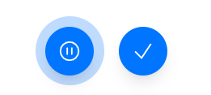

# react-audio-kit

react-audio-kit is a react ui library that contains the web based audio components in a well abstracted form.

## Installation

Install my-project with npm

```bash
npm i react-audio-kit
```

In case, you are using typescript for development, make sure to do following change in your ts config file :

```bash
 {
  ...
  "compilerOptions": {
    ...
    "moduleResolution": "node",
    ...
  }
  ...
 }

```

## Components

react-audio-kit comes with the following components :

### Audio Player :

This component provides you a simplest way to handle your playlists and gives you various features like :

- Pause/ Play audio
- Seek buffered-audio
- Loop control
- Volume control
- Custom theming

#### Preview


#### Usage

By default, this queue-player takes the list of audios to play and internally manages the states of the queue.

```javascript
import { AudioPlayer } from "react-audio-kit"; // import the component from library
import "react-audio-kit/style.css"; // don't forget to import the styles from the library

export default function Home() {
  return (
    <>
      <AudioPlayer
        theme={{   /// this is a optional prop, mostly for the customization
          baseMediaButtonColor: "#FF69B4",
          hoveredMediaButtonColor: "#FF1493",
          mediaIconColor: "white",
          text: "black",
          loaderColor: "pink",
          shadow: true,
        }}
        audios={audios}
      />
    </>
  );
}
const audios = [
  {
    src: "https://previews.customer.envatousercontent.com/files/247158961/preview.mp3",
    img: undefined,
    subheading: "Subtitle 2",
  },
  {
    src: "https://previews.customer.envatousercontent.com/files/247158961/preview.mp3",
    img: undefined,
    subheading: "Subtitle 2",
  },
];

```

#### API

You can customize and use the AudioPlayer using following props :

| Prop                 | Type                                                                                            | Description                                                                                               | Default  |
| -------------------- | ----------------------------------------------------------------------------------------------- | --------------------------------------------------------------------------------------------------------- | -------- |
| `audios`             | `Array<Audio>`                                                                                  | An array of audio objects to be played.                                                                   | -        |
| `getCurrentPlayback` | `(currentPlayback: CurrentPlaybackStateType & { bufferedProgressPercentage: number; }) => void` | A callback function that provides the current playback state, including the buffered progress percentage. | -        |
| `defaultPlayback`    | `CurrentPlaybackStateType`                                                                      | An object defining the default playback state.                                                            | -        |
| `preload`            | `"auto" \| "metadata" \| "none"`                                                                | Specifies if and how the audio should be preloaded.                                                       | `"auto"` |
| `theme`              | `Theme`                                                                                         | An object to customize the appearance of the audio player. See the `Theme` section below for details.     | -        |
| `hideImg`            | `boolean`                                                                                       | If true, hides the audio cover image.                                                                     | `false`  |
| `hideAudioName`      | `boolean`                                                                                       | If true, hides the audio name.                                                                            | `false`  |
| `hideLoopIcon`       | `boolean`                                                                                       | If true, hides the loop icon.                                                                             | `false`  |
| `onClickImage`       | `() => void`                                                                                    | A callback function triggered when the audio cover image is clicked.                                      | -        |
| `onClickTitle`       | `() => void`                                                                                    | A callback function triggered when the audio title is clicked.                                            | -        |
| `onClickSubtitle`    | `() => void`                                                                                    | A callback function triggered when the audio subtitle is clicked.                                         | -        |
| `borderRadius`       | `number`                                                                                        | Sets the border radius of the audio player.                                                               | -        |

#### Theme

The `theme` object allows customization of the audio player's appearance:

| Property                    | Type      | Description                                           | Default |
| --------------------------- | --------- | ----------------------------------------------------- | ------- |
| `baseMediaButtonColor`      | `string`  | Color of the media buttons.                           | -       |
| `hoveredMediaButtonColor`   | `string`  | Color of the media buttons when hovered.              | -       |
| `mediaIconColor`            | `string`  | Color of the media icons.                             | -       |
| `background`                | `string`  | Background color of the audio player.                 | -       |
| `text`                      | `string`  | Text color.                                           | -       |
| `loaderColor`               | `string`  | Color of the loading spinner.                         | -       |
| `baseControlButtonColor`    | `string`  | Color of the control buttons.                         | -       |
| `hoveredControlButtonColor` | `string`  | Color of the control buttons when hovered.            | -       |
| `controlButtonIconColor`    | `string`  | Color of the control button icons.                    | -       |
| `shadow`                    | `boolean` | If true, applies a shadow effect to the audio player. | `false` |

#### Audio
| Property     | Type     | Description                                                |
| ------------ | -------- | ---------------------------------------------------------- |
| `src`        | `string` | Address for the audio file                                 |
| `img`        | `string` | Image source (if any) for the respective image of the song |
| `heading`    | `string` | Title of the audio file                                    |
| `subheading` | `string` | Subtitle of the audio file                                 |

#### CurrentPlaybackStateType

| Property      | Type      | Description                                             |
| ------------- | --------- | ------------------------------------------------------- |
| `progress`    | `number`  | The current progress of the audio file                  |
| `isPlaying`   | `boolean` | Whether the audio is currently playing                  |
| `volume`      | `number`  | The volume level of the audio                           |
| `activeIndex` | `number`  | The index of the currently active audio in the playlist |
| `loading`     | `boolean` | Whether the audio is currently loading                  |
| `isError`     | `boolean` | Whether there was an error during playback              |
| `looped`      | `boolean` | Whether the audio is set to loop                        |

### Audio Recorder :

This component provides you a simplest way to your own voice in a well abstracted manner :

- Pause/ Resume/ Start recording
- Custom theming
- Getting audio blobs in certain time intervals
- Loudness indicators
- Senstivity management

#### Preview

Stopped Recording 


Recording


Paused


#### Usage

By default, audio recorder do not require any props. 

```javascript 
import { AudioRecorder } from "react-audio-kit"; // import the components from library
import "react-audio-kit/style.css"; // don't forget to import the styles from the library

export default function Home() {
  return (
    <>
      <AudioRecorder />
    </>
  );
}
```

The `AudioRecorder` component is a customizable audio recording utility with various event handlers and configurable properties. This document details the properties that can be passed to the component.

#### API

| Prop Name                    | Type                                      | Description                                                                                       |
|------------------------------|-------------------------------------------|---------------------------------------------------------------------------------------------------|
| `getAudioBlobOnStop`         | `(audioBlob: Blob) => void`               | Callback function that receives the final audio `Blob` when the recording stops.                  |
| `getCurrentAudioBlobPacket`  | `(audioBlob: Blob) => void`               | Callback function that receives the current audio `Blob` packets during recording.                |
| `handleError`                | `(error: any) => void`                    | Callback function that handles any errors that occur during the recording process.                |
| `timeSlice`                  | `number`                                  | Optional parameter specifying the time interval (in milliseconds) at which audio packets are delivered. |
| `onPause`                    | `() => void`                              | Callback function called when the recording is paused.                                            |
| `onRecord`                   | `() => void`                              | Callback function called when the recording starts.                                               |
| `onResume`                   | `() => void`                              | Callback function called when the recording resumes after being paused.                           |
| `onStop`                     | `() => void`                              | Callback function called when the recording stops.                                                |
| `sensitivity`                | `number`                                  | Optional parameter setting the microphone sensitivity.                                            |
| `color`                      | `Color`                                   | Object to customize the color scheme of the audio recorder UI.                                    |

#### Color 

| Property Name  | Type   | Description                                       |
|----------------|--------|---------------------------------------------------|
| `base`         | `string` | Base color for the audio recorder interface.      |
| `hover`        | `string` | Color used when elements are hovered over.        |
| `auora`        | `string` | Additional accent color for special UI elements.  |
| `iconColor`    | `string` | Color for icons within the audio recorder interface. |


### Contributing

Provide guidelines for contributing to the library.

```markdown
## Contributing

We welcome contributions! Please follow these steps to contribute:

1. Fork the repository.
2. Create a new branch: `git checkout -b my-feature-branch`.
3. Make your changes and commit them: `git commit -m 'Add new feature'`.
4. Push to the branch: `git push origin my-feature-branch`.
5. Submit a pull request.
```


## License

This project is licensed under the MIT License.
